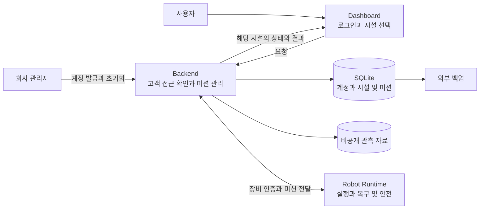

# Cleany 상용 서비스 설계 검토

현재 구현은 단일 시설·로봇의 미션 요청과 결과 처리를 검증하는 prototype이다. 고객별 계정과 데이터 소유 관계를 추가해 첫 고객에게 제공한다. **계정 발급·로그인·고객별 접근 격리는 구현했다. 보관·외부 백업·현장 검증은 남아 있다.**

## 1 정한 범위

| 항목 | 방향 |
|---|---|
| 고객 | 여러 매장을 소유할 수 있는 개인 |
| 첫 운영 | 고객 1명·시설 1곳·로봇 1대·동시 작업 1건. 시설 수는 데이터 모델에서 고정하지 않음 |
| 계정 | 회사가 아이디·임시 비밀번호 발급. 첫 로그인에서 사용자 비밀번호로 변경 |
| 권한 | 같은 고객의 사용자는 동일한 운영 권한. 다른 고객 데이터는 접근 불가 |
| DB | 기존 SQLite와 단일 Backend 유지 |
| 실패 처리 | 로봇이 판단·복구하고 Dashboard는 결과 표시 |
| 자료 | 완료 작업 상세·사진 30일 보관 기본안, 해당 고객 사용자 모두 열람 |
| 복구 | 일일 외부 백업·수동 복원 기본안. 복구 시간과 백업 보관 일수는 미정 |
| 제공 방식 | 로봇 임대 |

## 2 현재 기반과 필요한 변화

| 영역 | 현재 | 필요한 변화 |
|---|---|---|
| 계정 | 회사 발급·첫 비밀번호 변경·초기화·사용 중지 구현 | 운영 계정 발급과 배포 |
| 소유 관계 | 고객·시설 모델과 API·SSE·사진 접근 격리 구현 | 실제 고객 데이터 이관 |
| 시설 | 특정 지도와 좌석 fixture | 고객의 여러 시설을 연결할 수 있는 관리 데이터 |
| 기록 | 요청자·로봇 기록, 고객 범위 조회와 커서 조회 구현 | 30일 자료 보관 정책 적용 |
| 운영 | 로컬 백업·자동 재시작 배포 파일 | 외부 백업·복원 확인·기본 장애 알림 |

기존 중복 방지, commit 이후 ACK, 종료 결과 불변성, 단일 활성 미션은 유지한다. 다음 작업은 최종 결과와 fresh IDLE을 확인한 뒤 할당한다. Backend는 로봇 내부 FSM을 변경하지 않는다.

## 3 목표 구성

박스는 책임 구분이다. 초기에는 단일 Backend 안에서 구현한다. 고객 역할 세분화, 다중 로봇 할당, 다중 서버, 사람 검토 업무와 자동 결제는 후속 확장이다.

## 4 남은 작업

1. 실제 데이터 이관과 고객·계정·로봇 발급 후 운영 배포.
2. 시설별 실제 지도·좌석 및 Runtime 관측 자료 저장 연동.
3. 자료 보관, 외부 백업과 복원 확인.

30일 자료 삭제 때 중복 방지 기록이나 진행 중 미션을 함께 삭제하지 않는다. 자료별 삭제 범위와 백업 잔존 기간은 구현 전에 구체화한다.

테스트 고객 두 명으로 데이터 격리를 확인하고, 비밀번호 초기화·계정 중지 후 이전 세션이 차단되는지 검증한다. 로봇의 현장 작업과 안전은 별도 검증 대상이다.

[ERD와 계정 흐름 상세](mvp-data-and-account-design.md) · [현재 구조](control-plane-overview.md) · [Gateway 계약](robot-gateway-integration.md) · [배포 파일](../../tools/deploy/README.md)

현재 상태는 저장소 파일 기준이다. 배포 파일의 서버 적용 여부는 확인하지 않았다.
