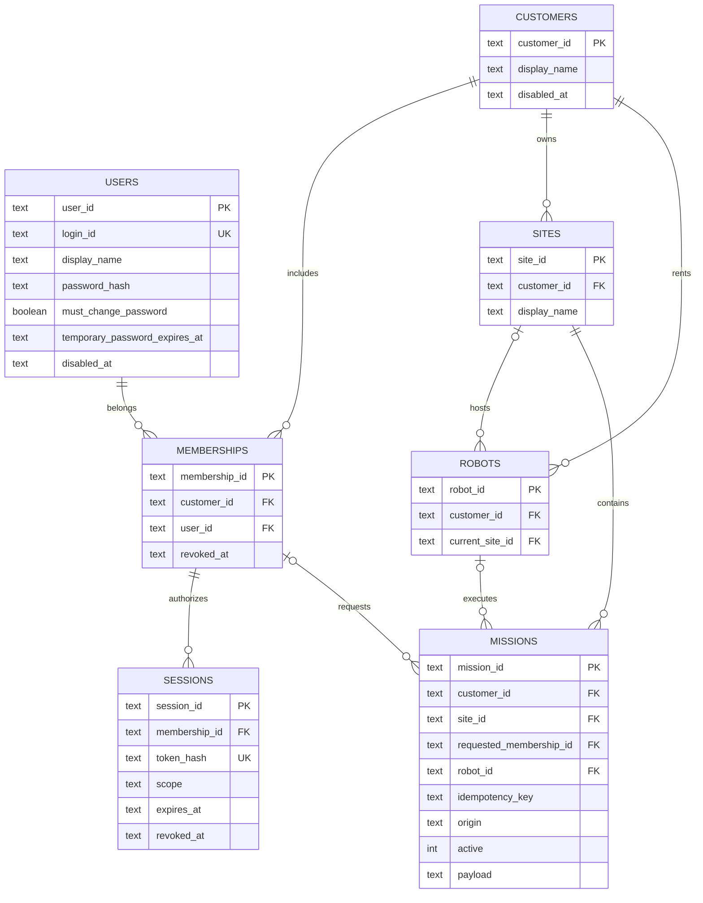
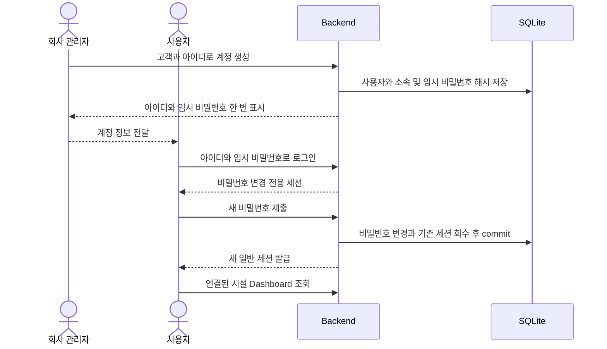

# Cleany MVP 데이터와 계정 설계

회사가 계정을 만들고 **아이디와 임시 비밀번호를 전달**한다. 사용자는 첫 로그인에서 비밀번호를 변경한 뒤 자신의 매장을 운영한다. 아래는 설계이며 아직 구현하지 않았다.

## 1 운영 범위

- 고객은 여러 매장을 소유할 수 있는 개인이다. 첫 운영은 고객 1명·시설 1곳·로봇 1대·동시 작업 1건이다.
- 같은 고객의 사용자는 모두 같은 권한을 갖는다. 계정마다 활성 고객 소속은 하나로 시작한다.
- 회사 관리자는 계정 생성·비밀번호 초기화·계정 비활성화를 담당한다.
- SQLite와 단일 Backend를 유지한다. 로봇의 실행 판단과 복구는 Robot Runtime이 담당한다.

## 2 ERD

핵심 컬럼만 표시했다. PK는 기본키, FK는 외래키, UK는 중복 불가다. 사용자 계정과 매장 소유 고객을 소속으로 연결한다.

- **사용자와 소속:** 아이디는 공백 제거·소문자화 후 유일하게 저장한다. 활성 소속은 사용자당 하나이며, 회수된 소속도 과거 미션을 위해 보존한다.
- **시설과 로봇:** 로봇의 현재 시설과 미션의 당시 시설을 구분한다. 배치 변경이 과거 이력을 바꾸지 않는다. 고객 간 로봇 이전은 후속 설계다.
- **미션:** 생성 시 고객·시설·요청 소속을 확정한다. `robot_id`는 대기 중 NULL, 최초 배정 때 기록한다. 기존 실행 내용은 `payload`를 유지한다.
- **DB 제약:** 미션의 시설·로봇·요청 소속은 같은 고객이어야 한다. 부모 테이블의 고객·ID 조합에 UNIQUE를 두고 복합 FK로 검사한다. FK만으로 활성 상태를 판단하지는 않는다.
- **중복과 실행:** `(customer_id, idempotency_key)`는 유일하다. 기존 단일 활성 미션과 종료 결과 불변 제약을 유지한다.

## 3 계정 발급과 첫 로그인

임시 비밀번호는 시스템이 무작위로 생성하고 관리자가 확인된 대상자에게 전달한다. 원문은 저장·로그 기록하지 않는다. DB에는 비밀번호 해시와 `must_change_password=true`를 저장한다.

첫 로그인 세션은 현재 계정 확인·비밀번호 변경·로그아웃만 허용한다. 변경 전에는 미션 API·사진·SSE에 접근할 수 없다. 변경 성공 시 임시 비밀번호를 폐기하고 모든 기존 세션을 회수한 뒤 새 일반 세션을 발급한다. 변경 트랜잭션에서 세션과 계정 상태를 다시 확인해 동시에 제출된 옛 세션을 거절한다.

이미 비밀번호를 변경한 사용자는 일반 로그인으로 바로 Dashboard에 들어간다. 시설이 여러 곳이면 선택하고, 한 곳이면 바로 연다.

## 4 비밀번호 분실과 계정 중지

| 상황 | 회사와 서비스의 처리 |
|---|---|
| 비밀번호 분실 | 관리자가 본인 확인 후 새 임시 비밀번호 발급. 기존 비밀번호·세션은 즉시 무효화하고 다음 로그인에 변경 요구 |
| 임시 비밀번호 분실·만료 | 관리자가 다시 초기화. 이전 임시 비밀번호는 사용할 수 없음 |
| 계정 사용 중지 | 계정 비활성화와 세션 회수. 열린 SSE도 종료 |
| 계정 재사용 | 관리자가 재활성화하고 새 임시 비밀번호 발급. 옛 세션은 복원하지 않음 |

계정 중지는 로봇의 실행 중 미션을 자동 취소하는 명령이 아니다. 기존 결과와 요청자 기록은 남긴다. 관리자 작업은 서버 관리 명령으로 시작하고 실행자·대상·시각을 기록한다.

## 5 접근과 인증 규칙

고객은 로그인 세션에서 결정한다. API·SSE·사진은 그 고객의 데이터만 제공하며 시설·계정 전환과 로그아웃 시 cache와 구독을 정리한다. 소속·계정·고객이 비활성 상태이면 접근을 거절한다.

비밀번호는 Argon2id로 해시하고 세션 원문은 Secure·HttpOnly·SameSite 쿠키에 둔다. DB에는 세션 토큰 해시를 저장한다. 변경 요청은 Origin과 CSRF를 검사하고 로그인 실패 횟수를 제한한다. [인증 저장 참고](https://cheatsheetseries.owasp.org/cheatsheets/Password_Storage_Cheat_Sheet.html), [세션 참고](https://cheatsheetseries.owasp.org/cheatsheets/Session_Management_Cheat_Sheet.html)

**시간 기본안:** 임시 비밀번호 24시간, 변경 전용 세션 10분, 일반 세션 최대 12시간·비활동 30분, SSE 권한 재검사 10초. 모두 설정으로 관리하며 자동 polling은 사용자 활동으로 세지 않는다. 임시 비밀번호가 만료되면 이미 발급된 변경 전용 세션도 사용할 수 없다.

필요한 인증 API는 `login`, `me`, `password/change`, `logout`, `session/touch`다. 회사 관리 기능은 계정 `create`, `reset-password`, `disable`, `reactivate`로 제한한다. 가입·초대·복구 링크 기능과 테이블은 두지 않는다.

## 6 구현 순서와 확인 기준

1. **데이터 이관:** 백업 후 고객·시설·계정 테이블과 미션 소유 컬럼을 추가한다. 기존 payload·미션 ID·inbox·outbox를 보존한다. 실제 요청자를 알 수 없는 기록은 `origin=legacy`, 요청 소속 NULL로 남긴다.
2. **계정 기능:** 회사 발급, 임시 로그인, 비밀번호 변경, 초기화와 비활성화를 구현한다. 변경 전 업무 접근과 초기화 후 옛 세션 접근이 차단되는지 확인한다.
3. **고객별 접근:** API·SSE·사진 조회와 Dashboard를 연결한다. 테스트 고객 두 명으로 다른 고객 접근 차단을 확인한다.
4. **배포:** 새 schema에 맞게 repository를 변경하고 Backend·Dashboard를 함께 배포한다. 앱 인증으로 전환하면서 사용자용 공통 Basic 인증을 제거하고 로봇 인증은 유지한다. Runtime과 재동기화한 뒤 작업을 연다.

DB 이관은 미확인 실행이 없는 상태에서 진행한다. 전역 idempotency 유일 제약을 고객별 제약으로 바꾸고 종료 결과 trigger·단일 활성 index는 유지한다. 신규 DB에 구버전 앱만 되돌리는 롤백은 하지 않는다.

[서비스 범위](commercial-service-design-review.md) · [설계 배경](../adr/0006-mvp-customer-account-provisioning.md) · [현재 DB](../../apps/backend/control_plane/persistence.py) · [계약](../../packages/contracts/README.md)
