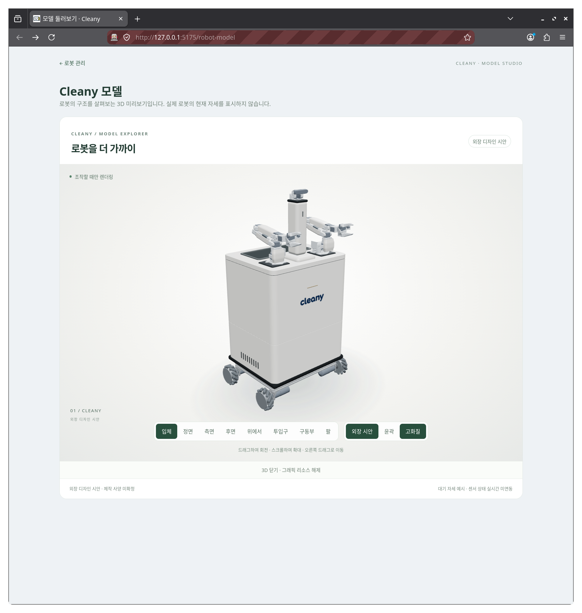

# Cleany 외장과 수거함 디자인 시안

`e718ac57` CAD의 접힌 대기 자세에 외장과 로봇 탑재 수거함을 추가한다.
로봇팔은 정면에서 물체를 잡고 팔 뒤쪽의 투입구로 옮겨 수거함에 보관하는
구성을 전제로 한다. 기존 카메라는 노출하고 고정 지지대와 지지대 커버는 유지한다.
제작 사양이나 실시간 로봇 상태를 나타내지 않는다.

## 구성

- 본체와 수거함 외장은 따뜻한 밝은 회색, 범퍼와 팔 받침은 짙은 회색으로 통일한다.
  무광에 가까운 재질과 중립적인 조명을 사용하고, 제공된 로고 위에는 작은 샴페인색 포인트를 둔다.
- 제공된 글자 로고를 상부 전면에 배치한다. 중심 높이는
  Y=600mm, 폭은 177mm이며 원본 비율에 맞춰 높이는 약 52mm다. 배경은
  투명하게 처리해 외장에 인쇄된 듯 표시하고, 샴페인색 포인트는 Y=678mm에 둔다.
  이미지 처리 방법은 `apps/dashboard/src/assets/brand/README.md`에 남긴다.
- 수거함의 네 벽과 바닥은 내부 용기를 이루며, 그 바깥의 연속된 외장이 네 알루미늄
  기둥과 모서리를 덮는다. 바깥에서 기둥별 커버나 내부 용기가 따로 드러나지 않는다.
- 팔 장착부 뒤쪽에 위치한 투입구. 얇은 회색 메탈 테두리, 상판, 하부 마감, 연결부가 모두
  같은 위치에서 뚫려 있어 수거함 바닥까지 이어진다.
- 카메라 본체의 추가 커버는 없다. 고정 지지대와 기존 팬·틸트·카메라 형상은 유지한다.
- 측면 통풍구와 하부 후면 정비 패널, 수거함 뒤쪽 손잡이는 외형 표현이다.
- 네 바퀴의 모터 축과 휠 허브 사이에는 표시용 금속 슬리브와 플랜지 형상을 둔다.
  실물 커플러 규격은 미확인이다.
- 각 팔의 위팔·아래팔 바깥면과 어깨 앞쪽에 얇은 커버를 둔다. 총 6개이며,
  본체와 같은 밝은 회색으로 마감한다. 접힌 팔 안쪽과 링크 양 끝은 열어 두고
  관절 축, 손목 카메라와 그리퍼는 노출한다.

좌표는 GLB와 같은 미터 단위이며 X+가 정면, Y+가 위쪽이다.
팔 장착부 중심 X=116mm에 대해 투입구 중심은 X=-80mm로 뒤쪽에 있다.
투입구 내부 단면은 앞뒤 164mm, 좌우 384mm이며 모서리와 테두리를 둥글게 처리한다.
수거함은 하부 전장부 위의 Y≈406mm부터 상판 아래 Y≈773mm까지 위치한다.
바닥의 내부 높이는 Y=416mm다. 이 치수는 외관 검토용이며 수거 용량이나
허용 물체 크기를 보장하지 않는다.

수거함 외장의 기본 단면은 앞뒤 458mm, 좌우 548mm이며 바깥 모서리 반경은 35mm다.
프레임 외곽 X=±200mm, Z=±250mm보다 바깥을 감싸며 하부 본체와 폭을 맞춘다.
상판 아래에는 약 1mm의 마감선을 두고 내부의 짙은 상판 테두리로 받친다.
수거함 뒤쪽에는 같은 색의 도어와 작은 손잡이를 표현한다.

하부 본체도 수거함과 같은 단면과 모서리 곡선으로 수직 압출한다. 중간의
돌출된 뚜껑과 띠를 제거하고, Y=403.5–404mm에 폭 0.5mm의 이음선만 남긴다.
그 안쪽은 동일한 색의 부품으로 막아 내부 프레임이 비치지 않게 한다.
상하부는 표면 위치와 법선이 같아 모서리의 음영도 이어진다.

하부 본체는 앞뒤 458mm, 좌우 548mm, 기본 압출 높이 242.5mm다. 바퀴 형상 상단
Y=127.003mm에 대해 외장 최하단은 Y=139mm로 정적 수직 여유가 약 12mm다.

원본 MJCF에는 모터와 축, 휠 허브가 있으며 별도 커플러 형상은 없다.
원본의 표시 형상 128개는 경량 GLB와 대기 자세 GLB에 모두 보존되어 있다.
네 모터의 축 끝과 휠 허브 안쪽 면 사이의 빈 간격은 각각 약 12.9mm다.
추가 슬리브는 이 간격을 잇고 모터 축 쪽으로 약 10.5mm, 허브 쪽으로 약 2mm
겹치도록 배치한다. 좌표는 기존 바퀴 축에 맞추고 형상은 외관 검토용으로 만든다.
이 치수는 실제 체결 규격, 토크 전달 성능이나 회전 간섭을 검증한 결과가 아니다.

팔 커버는 `RobotArmCovers.ts`가 원본 GLB의 링크 변환과 어깨 형상 경계에 맞춰
생성한다. 위팔과 아래팔에는 벽 두께 약 2.5mm의 C자 단면을 사용하며, 끝으로
갈수록 폭을 줄이고 곡면의 음영을 부드럽게 처리한다. 위팔 커버의 열린 면은
아래팔 쪽으로, 아래팔 커버의 열린 면은 위팔 쪽으로 향한다. 어깨 앞쪽 가드는
뒤가 열려 있고 어깨 회전축보다 아래에서 끝난다. 현재 대기 자세에 맞춘 시안이다.

## 표시와 비교

형상은 `apps/dashboard/src/components/RobotExterior.ts`가 생성하고,
`RobotModelCanvas`가 원본 GLB와 함께 표시한다. 원본 GLB나 CAD를 변경하지 않는다.
`외장 시안` 버튼은 수거함, 팔 커버와 표시용 커플러를 포함한 추가 그룹을 켜고 끄므로 같은 자세와 구도로
원본을 비교할 수 있다. `투입구` 버튼은 뒤쪽 위에서 입구를 가까이 보여준다.
`구동부` 버튼은 바퀴와 모터 축 연결부를 낮은 시점에서 확대한다.
`팔` 버튼은 양팔의 커버와 관절 주변을 가까이 보여준다. 좁은 패널에서는 보기
버튼이 줄바꿈되어 패널 밖으로 넘치지 않는다.
보기 버튼을 누르면 이전 드래그의 관성을 정리한 뒤 지정한 구도로 이동한다.

[전체 모습](assets/robot-wordmark-20260909/01-exterior.png) ·
[정면 로고](assets/robot-wordmark-20260909/02-front.png) ·
[팔 확대](assets/robot-arm-covers-20260908/02-arms.png) ·
[팔 뒤쪽 투입구](assets/robot-arm-covers-20260908/04-inlet.png) ·
[구동부 확대](assets/robot-drive-couplers-20260908/01-drive.png) ·
[연결부 확대](assets/robot-exterior-joint-20260908/02-joint-detail.png) ·
[후면](assets/robot-exterior-joint-20260908/04-rear.png) ·
[측면](assets/robot-exterior-joint-20260908/03-side.png) ·
[원본 비교](assets/robot-exterior-shell-20260908/04-original.png)

## 검증 범위

팔 커버 6개의 형상과 법선을 확인했다. 링크 바깥면의 12개 광선은 커버에 닿고
안쪽의 4개 광선은 열린 면으로 통과했다. 접힌 링크 사이의 30개 검사 지점에서
커버 간 거리가 양수였고, 손목·손목 카메라·그리퍼 관련 14개 부품의 경계 상자와
겹치지 않았다. 수거함 투입구의 9개 광선은 바닥에 처음 닿는다.
[팔 커버 검사 기록](assets/robot-arm-covers-20260908/checks.json)과
[같은 구도의 원본](assets/robot-arm-covers-20260908/03-original.png)을 남긴다.
기존 GLB의 해시와 128개 형상은 유지한다. 이 검사는 현재 자세의 제한된 표본이며,
관절의 전체 가동 범위나 카메라 시야를 검증한 결과는 아니다.

원본 MJCF와 두 GLB의 표시 형상 ID 집합이 일치하는지 확인했다. 추가한 네
커플러의 중심축 정렬과 양 끝의 겹침 범위를 검사했고, 기존의 빈 구간에서
총 20개 단면 광선이 모두 커플러 표면에 닿았다.
[구동부 검사 기록](assets/robot-drive-couplers-20260908/checks.json)과
[같은 구도의 원본](assets/robot-drive-couplers-20260908/02-original.png)을 남긴다.

Firefox에서 렌더링하고 niri로 캡처했다. 연결부의 24개 방향에서 상하부의
표면 위치와 법선이 일치하며, 이음선 안쪽이 막혀 있는 것을 확인했다.
투입구의 9개 광선도 수거함 바닥에 먼저 닿는다.
[연결부 검사 기록](assets/robot-exterior-joint-20260908/checks.json)에 수치를 남긴다.

이전 외장에서는 네 기둥 위치를 각각 다섯 높이와
세 방향에서 검사한 60개 광선 모두 프레임 위치에 닿기 전에 외장을 만났다.
추가 카메라 커버가 없고 지지대 커버 네 부품이 유지되는지도 확인했다.
투입구의 3×3 지점에서 아래로 광선을 쏘아
상판에 가로막히지 않고 수거함 바닥(Y=416mm)에 처음 닿는 것을 확인했다.
같은 경로에 원본 CAD가 끼어들지 않는지는 이전 수거함 시안에서 GLB 삼각형의
수직 교차 계산으로 [확인했다](assets/robot-exterior-bin-20260908/checks.json).
이번 변경은 GLB와 투입구 위치를 유지한다.
[프레임 가림 검사 기록](assets/robot-exterior-shell-20260908/checks.json)에 수치를 남긴다.
외장 토글과 정지 상태의 렌더링 중단도 확인했다.

이 검사는 정적 디자인 시안의 제한된 확인이다. 물체의 실제 크기를 반영한 투입,
팔의 도달 범위와 이동 경로, 모든 자세에서의 간섭, 전체 센서 시야, 냉각과 구조
강도는 검증하지 않았다. 가짜 투입 동작이나 실시간 보관 상태를 표시하지 않는다.

뷰어 테스트, 계약 검사, TypeScript와 프로덕션 빌드의 실행 명령은
`apps/dashboard/README.md`의 3D 모델 항목을 따른다.
